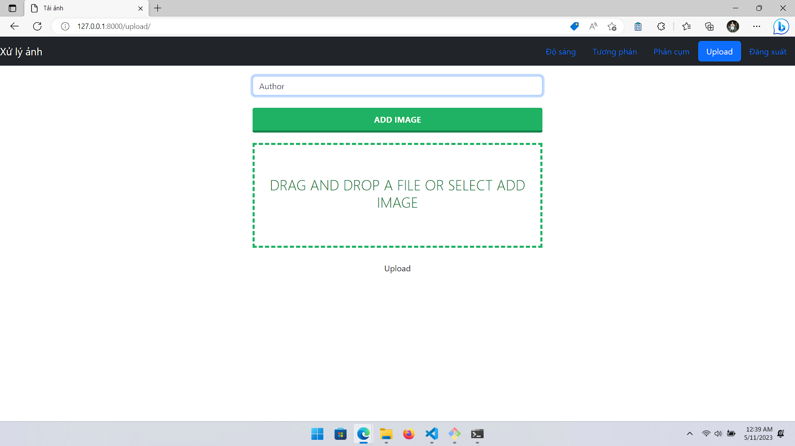
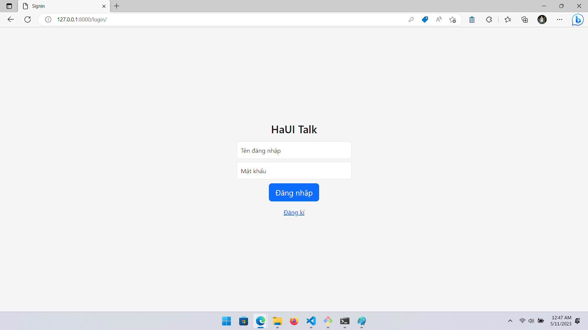
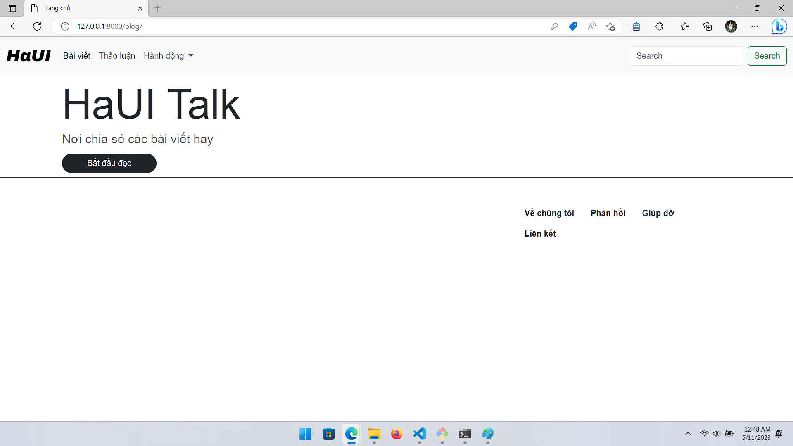
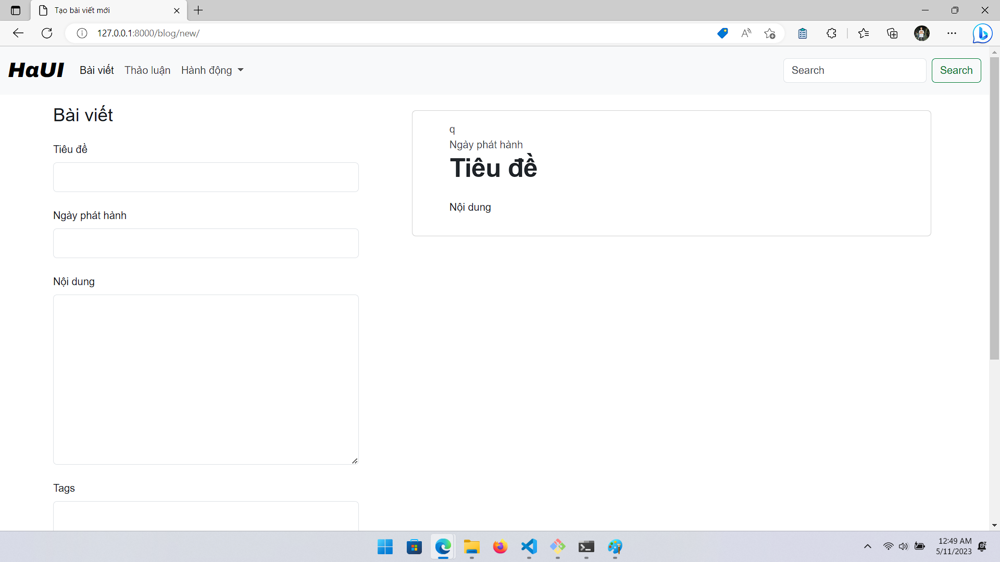

# Môi trường Docker

## Dockerfile

### Version 1.0.0

``` Dockerfile
# Môi trường chạy
FROM python:alpine3.17
# Thư mục làm việc
WORKDIR /usr/src/django_project
# Các biến môi trường
ENV PYTHONDONTWRITEBYTECODE 1
ENV PYTHONUNBUFFERED 1

# Chạy cài thư viện
RUN apk update
RUN pip3 install --upgrade pip
RUN apk add --no-cache --virtual .build-deps gcc g++ build-base freetype-dev libpng-dev openblas-dev py3-scipy
RUN pip3 install numpy scipy
RUN pip3 install --extra-index-url https://alpine-wheels.github.io/index numpy
RUN pip3 install --extra-index-url https://alpine-wheels.github.io/index opencv-python
RUN pip3 install --extra-index-url https://alpine-wheels.github.io/index Pillow
RUN pip3 install --upgrade pip 
COPY ./requirements.txt /requirements.txt
RUN pip3 install --no-cache-dir -r /requirements.txt

# Sao chép thư mục của app vào thư mục làm việc
COPY . /usr/src/django_project
RUN adduser -D user
RUN chown -R user:user /usr/src/django_project
USER user
EXPOSE 8000
CMD ["python3", "manage.py", "runserver", "0.0.0.0:8000"]
```

### Version 2.0.1

```Dockerfile
# Môi trường
FROM python:3.10-slim
# Thư mục làm việc
WORKDIR /user/src/django_project
# Các biến môi trường
ENV PYTHONDONTWRITEBYTECODE 1
ENV PYTHONUNBUFFERED 1
# Cài đặt thư viện
RUN apt-get update && apt-get install ffmpeg libsm6 libxext6  -y
COPY ./requirements.txt ./
RUN pip3 install --no-cache-dir -r requirements.txt
# Sao chép thư mục ở máy vào thư mục làm việc
COPY . /user/src/django_project

RUN adduser user
RUN chown -R user:user /user/src/django_project
USER user
EXPOSE 8000

CMD ["python3", "manage.py", "runserver", "0.0.0.0:8000"]
```

## Docker-compose
``` yml
version: '3'

services:
  app:
    build: .
    ports:
      - 8000:8000
    volumes:
      - .:/usr/src/django_project
    image: app:django_project
    container_name: django_container
    command: python manage.py runserver 0.0.0.0:8000
```

## Database

### Version [1.0.0, 2.0.1]

```python
# sqlite3
DATABASES = {
    'default': {
        'ENGINE': 'django.db.backends.sqlite3',
        'NAME': BASE_DIR / 'db.sqlite3',
    }
}
```

## Mô tả

### Version 1.0.0



### Version 2.0.1





# Môi trường chạy từ file

## Cách chạy (anaconda)

``` bash
# tải dự án về máy
git clone https://github.com/nguyenvanvutlv/django_docker.git (base)

cd django_project                                             (base)(main)

# Chuyển sang nhánh blog do nhánh này đang ổn định nhất
git checkout blog                                             (base)(blog)


# Cài đặt môi trường
conda create -n dp --file requirement.yml                     (base)(blog)
conda activate dp                                             (dp)(blog)


# Chạy dự án
python manager.py runserver                                   (dp)(blog)
```

## Database

### Version 1.0.0

- Sử dụng sqlite3

### Version 2.0.1

- Sử dụng MySQL, cấu hình cài đặt MySQL Workbench 8.0 CE

```python
DATABASES = {
    "default": {
        "ENGINE": "django.db.backends.mysql",
        "NAME": "haui_project",
        "USERNAME" : "root",
        "PASSWORD" : "root",
        "HOST": "127.0.0.1",
        "PORT": "3306",
        'OPTIONS': {  
            'init_command': "SET sql_mode='STRICT_TRANS_TABLES'"  
        } ,
    }
}
```